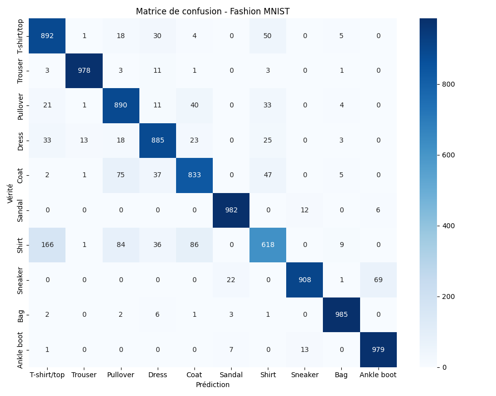

# Rapport Technique

## 1. Choix du dataset

Le dataset [Fashion MNIST](https://www.kaggle.com/datasets/zalando-research/fashionmnist?resource=download) a été retenu car il semblait être le plus "facile" parmi les jeux de données proposés, basé sur la complexité des images, la taille des jeux de données et le niveau de prétraitement nécessaire.

🤖 : "Pourquoi c’est facile : Très propre, standardisé, comme MNIST (chiffres manuscrits), mais plus pertinent."

- Type : Images 28x28 en niveaux de gris (gris, 10 classes de vêtements)
- Facilité :
  - Format uniforme, prêt à l’emploi.
  - Données prétraitées et équilibrées.
  - Parfait pour débuter en classification d’images (CNN simples).

## 2. Architecture du modèle et hyperparamètres

Le modèle MobileNetV3 a été choisi pour sa légèreté et son efficacité, ce qui facilite un entraînement rapide sur CPU tout en conservant une bonne capacité de généralisation.

## 3. Métriques de performances du modèle

- Accuracy sur jeu de test : 0.8950

Cette matrice de confusion illustre la qualité des prédictions du modèle pour chacune des 10 classes :



## 4. Structure de l'API FastAPI

- app.py : point d’entrée de l’application FastAPI, avec deux endpoints principaux :
  - /image-view : affiche une image à partir d’une URL
  - /image-classify : réalise la classification d’une image à partir d’une URL
- api/model_wrapper.py : classe dédiée au chargement du modèle et à la prédiction.

## 5. Contenu du Dockerfile et explications.

- Image de base : python:3.12.7

```bash
FROM python:3.12.7
```

- Copie du fichier requirements.txt

```bash
COPY ./requirements.txt /code/requirements.txt
```

- Définition du répertoire de travail

```bash
WORKDIR /code
```

- Installation des dépendances Python du projet

```bash
RUN pip install --no-cache-dir --upgrade -r /code/requirements.txt
```

- Copie du code de l'api et des poids du modèle dans le conteneur

```bash
COPY ./api /code/api
COPY ./model /code/model
```

- Déclaration de la variable d'environnement indiquant le chemin des poids du modèle (utilisée dans model_wrapper)

```bash
ENV WEIGHT_PATH=model/mobilenetv3_fashionmnist.pth
```

- Documente le port sur lequel le conteneur va écouter

```bash
EXPOSE 80
```

- Commande de démarrage du serveur uvicorn sur le port 80

```bash
CMD ["uvicorn", "api.app:app", "--host", "0.0.0.0", "--port", "80"]
```

## 6. Commandes Docker :

- Construire l'image à partir du DockerFile :

```bash
docker build -t fashion_classifier:1.0.0 .
```

- Lancer un conteneur en mappant le port 8080 local sur le port 80 du conteneur :

```bash
docker run -d -p 8080:80 fashion_classifier
```

- Pousser l’image sur Docker Hub :

```bash
docker login
docker tag fashion_classifier:1.0.0 hyzo/fashion_classifier:latest
docker push hyzo/fashion_classifier:latest
```

## 7. Déploiement sur EC2

- Lancement de l’instance :

  - AMI : Ubuntu
  - Instance type : t2.micro
  - Security group : autoriser
    - SSH (port 22 depuis mon IP)
    - HTTP (port 80)

- Connexion à l'instance via SSH

  ```bash
  chmod 400 "<nom clé>"
  ssh -4 -i "<nom clé>" ubuntu@<adresse ip public instance>
  ```

- Installation Docker

```bash
sudo apt update
sudo apt install -y docker.io
sudo usermod -aG docker $USER # pour ne pas avoir à taper sudo docker à chaque fois, juste docker
newgrp docker  # pour éviter de relancer la session
docker --version  # pour vérifier que ça fonctionne
```

- Connexion à Docker Hub

```bash
docker login
```

- Téléchargement de l’image et lancement:

```bash
docker pull hyzo/fashion-classifier
```

- Lancer le conteneur

```bash
docker run -d -p 80:80 hyzo/fashion_classifier
```

## 8. Exemple de test API via Swagger

L’interface Swagger est accessible à l’adresse :

```bash
http://35.180.119.212/docs
```

## 9. Difficultés rencontrées et pistes d’amélioration

- Taille de l’image Docker initialement trop élevée. Solutions envisagées :
  - utiliser une image python slim
  - installer uniquement la version CPU de PyTorch
